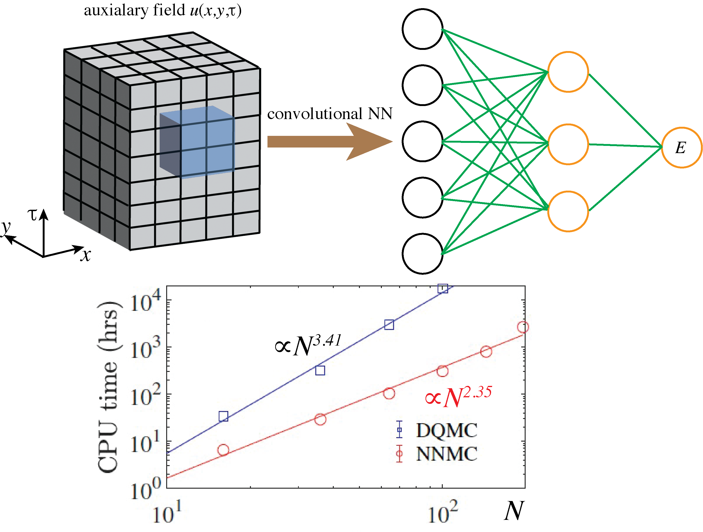
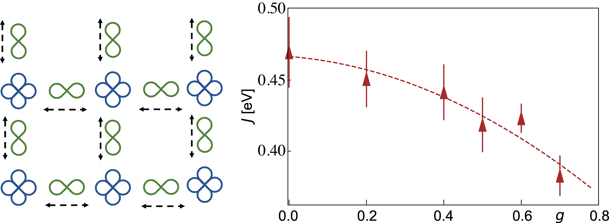

## **Project 1: Neural Network Quantum Monte Carlo**

    
  
Neural Network Quantum Monte Carlo

In this work, we develop Neural Network Quantum Monte Carlo (NNQMC) to accelerate quantum simulations. Our approach leverages auxiliary fields generated by the Determinant Quantum Monte Carlo (DQMC) method to train a convolutional neural network (CNN), which learns to predict the system energy. The CNN’s predictions are then integrated into NNQMC to compute the update ratio for each Monte Carlo step. Crucially, NNQMC achieves a computational complexity of $$\mathcal{O}(N^{2.35})$$, significantly lower than DQMC’s $$\mathcal{O}(N^{3.41})$$, enabling faster large-scale simulations.

**Papers**:  
Shaozhi Li, Philip M. Dee, Ehsan Khatami, and Steven Johnston, Phys. Rev. B 100 020302(R) (2019). [PDF](https://journals.aps.org/prb/pdf/10.1103/PhysRevB.100.020302)

## **Project 2: Nonlocal Electron-Phonon interaction**

    
  
The effect of nonlocal e-ph interaction on the superexchange interaction.

In this work, we develop a Determinant Quantum Monte Carlo (DQMC) method capable of simulating nonlocal electron-phonon (e-ph) interactions in two-dimensional systems. Applying this approach to study breathing phonons in cuprate superconductors, we find that the nonlocal e-ph interaction suppresses the superexchange interaction (J), thereby reducing superconducting pairing in these materials.

**Papers**:  
Shaozhi Li and Steven Johnston, npj quantum materials 5 40 (2020) [PDF](https://www.nature.com/articles/s41535-020-0243-3).  
Shaozhi Li and Steven Johnston, Phys. Rev. B 108 L201113 (2023) [PDF](https://journals.aps.org/prb/pdf/10.1103/PhysRevB.108.L201113)  
    
## **Project 3: Topological Superconductor**

    
  
Interfacial electron-phonon interaction induced topological superconductivity.

In this work, we propose a new Rashba-free mechanism to realize topological superconductivity with electron-phonon (e-ph) interaction. In the presence of a magnetic field, e-ph interaction with small momentum transfer is found to favor spin-triplet Cooper pairing. This process facilitates the formation of chiral topological superconductivity even with Rashba spin-orbital coupling is absent. As a proof of concept, we propose an experimentally feasible heterostructure to systematically study the entangled relationship among forward-phonon scatterings, Rashba spin-orbital couplings, pairing symmetries, and superconducting topology. Our theory sheds light on the important role of e-ph coupled materials in the pursuit of non-Abelian Majorana quasiparticles.

**Papers**:  
Shaozhi Li, Lun-Hui Hu, Rui-Xing Zhang, Satoshi Okamoto, Communications Physics 6, 235 (2023). [PDF](https://www.nature.com/articles/s42005-023-01311-z)